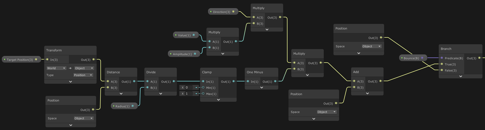

# Vertex Shader: Bounce Effect

Vertex shader that creates a bounce effect in geometry.

<p align="center">
  <br>
</p>

At GDC 2013, Jonathan Lindquist from Epic Games did a <a href="https://www.youtube.com/watch?v=7Fl3so0Z5Tc">talk</a> about Fornite's procedural animations. These animations were based on vertex displacements using vertex shaders. The main goal of these animations was to make hitting and destroying things fun. The technique used to create the bounce effect is simple, elegant and the final result is very engaging.

The first thing needed is the impact position on the object. In this example a ray is casted from the camera to the scene and checks if the gameobject hit has an `BounceReceiver` component.

```
Ray ray = Camera.main.ScreenPointToRay(Input.mousePosition);

RaycastHit hit;
if( Physics.Raycast(ray, out hit) )
{
  BounceReceiver receiver = hit.transform.GetComponent<BounceReceiver>();
  if( receiver )
  {
    receiver.Impact(hit.point, ray.direction);
  }
}
```

Then, the `BounceReceiver` sets the material properties that the shader is going to use.
<ul>
  <li><strong>_TargetPosition</strong>. Position of the bounce in world space.</li>
  <li><strong>_Direction</strong>. Direction of the bounce.</li>
  <li><strong>_Radius</strong>. Radius of the bounce.</li>
  <li><strong>_Amplitude</strong>. Amplitude of the bounce.</li>
  <li><strong>_Value</strong>. Value from 0 to 1 used to animate, evaluated using an <a href="https://docs.unity3d.com/ScriptReference/AnimationCurve.html">AnimationCurve</a>.</li>
  <li><strong>_Bounce</strong>. Boolean flag used to play and stop the animation.</li>
</ul>

```
material.SetVector("_TargetPosition", position);
material.SetVector("_Direction", direction);
material.SetFloat("_Radius", radius);
material.SetFloat("_Amplitude", amplitude);
material.SetFloat("_Value", curve.Evaluate(currentTime / totalTime));
material.SetInt("_Bounce", 1);
currentTime = 0;
isAnimating = true;
```

When the animation is playing the `_Value` is updated every frame in the `Update` method.

```
currentTime += Time.deltaTime;
material.SetFloat("_Value", curve.Evaluate(currentTime / totalTime));
```

In the shadergraph a distance value is calculated from the vertex position in object space to the `TargetPosition` (transformed from world space to object space). This distance is divided by the `Radius`, clamped (between 0 and 1) and the result is substracted from 1. Then this result is multiplied by the `Direction` * `Amplitude` * `Value` (the offset in the normal direction at the given animation time). The next step is to add this value to the vertex position in object space and lastly the boolean flag `Bounce` is checked to output the final result (or the vertex position not displaced) to the position input of the main node.

<p align="center">
  <br>
</p>

References.
> <a href="https://www.gdcvault.com/play/1018192/The-Inner-Workings-of-Fortnite">The Inner Workings of Fornite's Shader-Based Procedural Animations</a>
